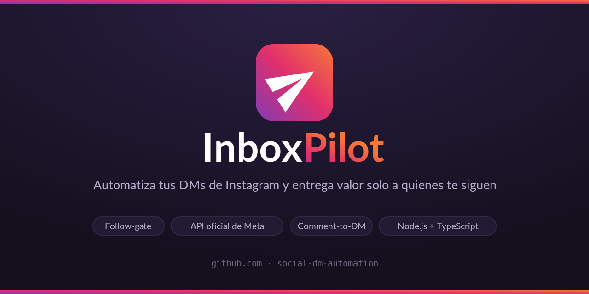
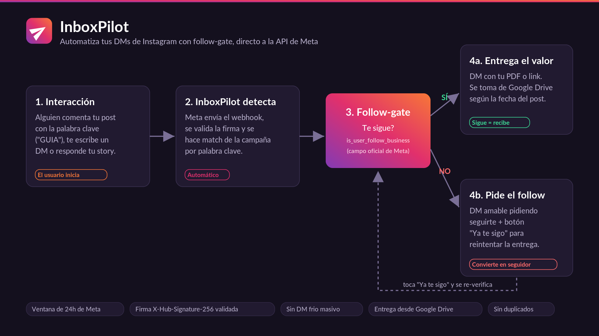

<p align="center">
  
</p>

<h1 align="center">InboxPilot</h1>

<p align="center">
  <b>Automatiza tus DMs de Instagram, conectado directo a la API de Meta.</b><br>
  Alguien comenta una palabra clave en tu post → recibe un DM con un botón → al tocarlo,
  le entregas el recurso (PDF, artículo o video). Con <b>follow-gate</b> y dentro de las
  reglas de Meta. Sin intermediarios tipo ManyChat.
</p>

---

## ¿Qué hace?

Convierte comentarios en conversaciones y leads, automático:

1. Publicas un post cuyo copy dice *"Comenta AUTOMATIZA y te lo envío"*.
2. Alguien comenta **AUTOMATIZA** (o `guía`, `ver más`… lo que definas).
3. InboxPilot le manda un DM: *"¡Hola! Toca abajo para recibirlo"* + botón **[Obtener el enlace]**.
4. La persona toca el botón → se verifica que **te siga** → recibe el link/documento.

Las palabras y los links salen de una **Google Sheet** que tú manejas — sin tocar código.

<p align="center">
  
</p>

## Características

- 🔌 **Directo a la API de Meta** (Instagram) — sin plataformas intermediarias.
- 💬 **Comment-to-DM** con botón (patrón ManyChat) dentro de las ventanas de Meta.
- 🔒 **Follow-gate**: entrega el recurso solo a quien te sigue (`is_user_follow_business`).
- 📄 **Recursos desde Google Sheet**: palabra → link (PDF de Drive, web o YouTube). Editas la hoja, cambios en ~1 min.
- 🧠 **Match robusto**: ignora tildes, mayúsculas, signos y palabras extra (`guía` = `GUIA` = `Guia!`).
- 🛡️ Valida la firma `X-Hub-Signature-256` de cada webhook; evita reenvíos duplicados.
- 🧩 **Arquitectura de adaptadores** — hoy Instagram; extensible a Facebook.
- 🧪 **Modo DRY_RUN** para probar todo el flujo sin credenciales.

## Qué NO hace (a propósito)

- ❌ DM masivo en frío a desconocidos (prohibido por Meta = ban).
- ❌ LinkedIn / YouTube DMs (sus APIs no lo permiten).

> ⚠️ Lee [`docs/COMPLIANCE.md`](docs/COMPLIANCE.md). Meta solo permite mensajear dentro de una
> ventana de 24h que **el usuario** abre al interactuar. InboxPilot opera dentro de esas reglas.

## Cómo configuras tus campañas

Todo vive en tu **Google Sheet** de planeación (guía: [`docs/RESOURCES_SHEET.md`](docs/RESOURCES_SHEET.md)):

| CTA (columna) | Recurso_DM (columna) |
|---|---|
| Comenta **AUTOMATIZA** → DM | https://tu-web.com/articulo |
| Comenta **GUIA** → DM | https://drive.google.com/…/guia.pdf |

El sistema saca la **palabra** del CTA y el **link** de `Recurso_DM`. Agregas filas = agregas campañas.

## Stack

Node.js + TypeScript · Express · Zod · Pino · Google Sheets (CSV). Estado en memoria (cambiable a Redis/Postgres). Deploy en Render (Docker).

## Arranque rápido

```bash
npm install
cp .env.example .env      # rellena los valores (ver docs/SETUP_META.md)
npm run dev               # servidor en http://localhost:3000
npm test                  # tests
npm run typecheck
```

### Probar sin credenciales (DRY_RUN)

Con `DRY_RUN=true`, el server simula la API de Meta (loguea en vez de llamar):

```bash
node execution/simulate_webhook.mjs comment "quiero AUTOMATIZA"   # comment-to-DM
node execution/simulate_webhook.mjs follow-check default          # botón "ya te sigo"
```

## Documentación

- [`docs/SETUP_META.md`](docs/SETUP_META.md) — crear la app Meta, token, webhook.
- [`docs/DEPLOY.md`](docs/DEPLOY.md) — deploy a Render (URL fija).
- [`docs/RESOURCES_SHEET.md`](docs/RESOURCES_SHEET.md) — la Google Sheet de recursos.
- [`docs/APP_REVIEW.md`](docs/APP_REVIEW.md) — App Review para responder al público.
- [`docs/CONNECTIONS.md`](docs/CONNECTIONS.md) — estado de cada integración.
- [`docs/ARCHITECTURE.md`](docs/ARCHITECTURE.md) · [`docs/COMPLIANCE.md`](docs/COMPLIANCE.md) · [`AGENTS.md`](AGENTS.md)

## Roadmap

Adaptador Facebook · persistencia en DB · broadcast a ventanas abiertas · App Review (acceso público).

## Licencia

MIT — ver [`LICENSE`](LICENSE).
